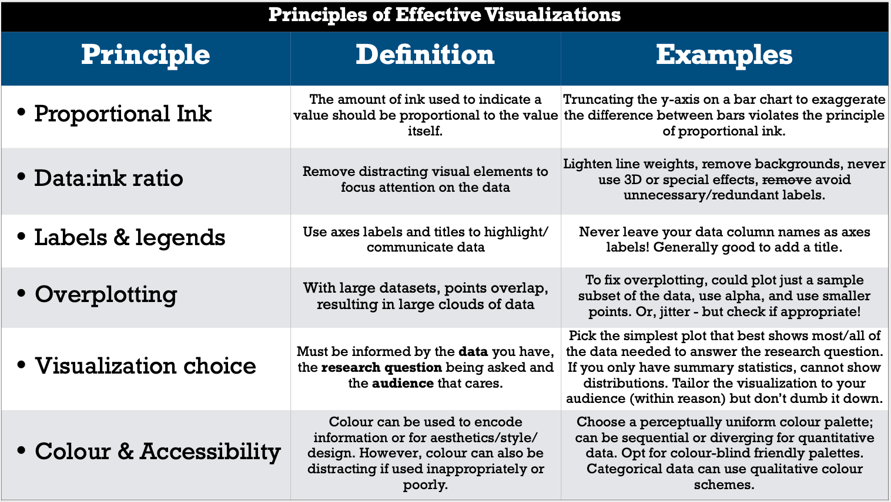

```{r setup, include=FALSE}
knitr::opts_chunk$set(echo = TRUE)
```

In this milestone you will be expected to choose a dataset appropriate for the STAT 547 team project.
The most important task for this milestone is to select an appropriate dataset and do some basic EDA to prepare for milestone 2.

## Expectations
- You should be committing to git every time you work on this project.
- git commit messages should be meaningful. These will be marked. It's OK if one or two are less meaningful, but most should be.
- After the repository is set-up, each group member should fork the repository to their personal GitHub.com account and work there, and send pull-requests of their work to the upstream repo (the one they forked). The other team mate should review, critique (if necessary) and finally accept their team mates pull request.
  - See below for "how to catch up to a forked repo if there are changes upstream".
- Use GitHub issues to communicate to their team mate (as opposed to email or Slack)
- Your question, analysis and visualization should make sense. It doesn't have to be complicated.
- You should use proper grammar and full sentences in your README. Point form may occur, but should be less than 10% of your written documents.
- You **must** include the URL of your public project's repo in the `README.md` file of your `milestone1` repo,  so we know where to find it.
- Create a release on your project repo named milestone1 and submit that URL on Canvas for us to grade.
  - Here is an example of the URL we are expecting for milestone1: 

### How to catch up to a forked repo if there are changes upstream

> The first time you need to catch up, you have to tell your computer where the upstream repo is via (you should do this locally inside your forked version of the repo):
> `git remote add upstream <original_repo_URL>`
>
> Then to catch up this time (and any other time) you type:
>
> `git fetch upstream`
> `git merge upstream/master`
>
> These two commands together are like a git pull from the repo you forked.
> 
> Finally, to update your forked remote, push the upstream changes you now have locally
> `git push`

## Mechanics (20%)

Follow the instructions for making a tidy submission, found on the [assignments home page](https://stat545.stat.ubc.ca/evaluation/assignments).

If there's any further uncertainty in determining a grade for this "mechanics" portion, the [UBC MDS mechanics rubric](https://github.com/UBC-MDS/public/blob/master/rubric/rubric_mech.md) will be referred to.

## Writing (10%)

- You must use proper English, spelling, and grammar.
- You should write concisely. 
- If there's any further uncertainty in determining a grade here, the [UBC MDS writing rubric](https://github.com/UBC-MDS/public/blob/master/rubric/rubric_writing.md) will be used.

## Task 1. Choosing a dataset (20%)

**Note: Though it may sound easy, it is not trivial to choose an interesting and relevant dataset. There are many, many thousands out there and the [tyranny of choice](https://www.economist.com/christmas-specials/2010/12/16/you-choose) is pretty overwhelming. I suggest you choose an "industry/sector" (health, technology, finance, sports, etc...), then set a 60 minute timer, start searching, and then choose one before the timer expires. You are welcome to post an issue in the course repo if you want advice or approval of a dataset.**

Below are some examples of the datasets you are welcome to use for your project: 
  
  - [Bike sharing](https://archive.ics.uci.edu/ml/datasets/bike+sharing+dataset)
  - [Medical expenses](https://gist.github.com/meperezcuello/82a9f1c1c473d6585e750ad2e3c05a41)
  - [Default of credit card](https://archive.ics.uci.edu/ml/datasets/default+of+credit+card+clients)
  - [Wine quality](http://archive.ics.uci.edu/ml/datasets/Wine+Quality)
  - [Adult incomes](https://archive.ics.uci.edu/ml/datasets/adult)
  - [Parkinsons Telemonitoring](https://archive.ics.uci.edu/ml/datasets/Parkinsons+Telemonitoring)
  - [Airbnb dataset](http://insideairbnb.com/get-the-data.html) (you can find informations about several cities here, you can pick up the one you want)
  - [Air quality dataset](https://archive.ics.uci.edu/ml/datasets/Air+Quality)

Here are the requirements for choosing a dataset:

**Permission to use and distribute**

  - Look for a creative commons license (CC4 for e.g.) or Public Domain and check to make sure you can make it publicly available
  - Do not use datasets that require authentication, or APIs
  
**Data quality**

  - Try to choose datasets that have no more than 5-10% missing values
  - Since we'll be doing linear regression, you should look for datasets that have quantitative measures
  - Ensure there are over 5000 rows/observations in the dataset
  - Ensure there are at least 5 variables of potential interest in the dataset
  
**Interesting (to you)**

  - Make sure you have some basic interest in the subject matter!
  - There's nothing worse than doing a 6 week project on the `iris` or `mtcars` dataset (please don't pick those)

There are literally hundreds of thousands of datasets available, I will point you to some high quality sources (keep in mind that I have not personally checked every single dataset):

- [fivethirtyeight](https://data.fivethirtyeight.com)
- [pudding.cool](https://github.com/the-pudding/data)
- [Buzzfeed](https://github.com/BuzzFeedNews/everything)
- [Data.gov](https://www.data.gov/)
- [data.world](https://data.world/) (requires free account)
- [kaggle](https://www.kaggle.com/datasets?license=cc)

## Task 2. **Project Proposal and EDA** (50%)

This task is the bulk of the work for milestone1.

### **Task 2.1: Introduce and describe your dataset.**

Consider the following questions to guide you in your exploration:

- Who: Which company/agency/organization provided this data?
- What: What is in your data?
- When: When was your data collected (for example, for which years)?
- Why: What is the purpose of your dataset? Is it for transparency/accountability, public interest, fun, learning, etc...
- How: How was your data collected? Was it a human collecting the data? Historical records digitized? Server logs?

*Additional Guidance: Your audience is fellow data scientists. You probably will not need more than 150 words to describe your dataset. All the questions above do not need to be answered, it's more to guide your exploration and think a little bit about the context of your data. It is also possible you will not know the answers to some of the questions above, that is FINE - data scientists are often faced with the challenge of analyzing data from unknown sources. Do your best, acknowledge the limitations of your data as well as your understanding of it. Also, make it clear what you're speculating about. For example, "I speculate that the {...column_name...} column must be related to {....} because {....}."*

### **Task 2.2: Load your dataset (from a file or URL).**

- Remember that others will be running your analysis notebook so it's important that the data is accessible to them. 
- If your dataset isn't accessible as a URL, make sure to commit it directly into your repo.

### **Task 2.3: Explore your dataset**

- Perform some exploratory data analysis (EDA) to understand your dataset better. Some questions to consider:
  - How many variables are present?
  - What is the range of values for each variable?
- Make some plots (3-5) of the relationships between cretain variables of interest.
  - The 
  - Remember [principles of effective plots](https://stat545guidebook.netlify.com/effective-visualizations.html)!
  - A handy table is reproduced below:

{#id .class width=70%}

A correllogram may be useful:
```{r correllogram, warning = FALSE, message = FALSE}
library(tidyverse)
# Installs the `corrplot` library if not already installed
#if (!requireNamespace("corrplot")) install.packages("corrplot")
library(corrplot)

# The `cor` function takes the correlation of every column against every other column
mtcars_correlations <- cor(mtcars) 

# Let's round the values to 2 decimal places and then plot it
mtcars_correlations <- round(mtcars_correlations,2)
corrplot(mtcars_correlations, 
         type="upper", 
         method="color", 
         tl.srt=45,
         addCoef.col = "black",
         diag = FALSE)
```

Another useful technique is to faceted plots:

```{r faceted_plots}
library(tidyverse)
ggplot( mtcars , aes(x=mpg, y=wt )) + 
  geom_point() +
  theme_bw() +
  facet_grid( cyl ~ gear, labeller = label_both) +
  labs(x = 'Fuel efficiency (miles per gallon)',
       y = 'Weight (1000 lbs)',
       title = "Exploring the mtcars dataset")

```


### **Task 2.4: Research question & plan of action**

1. With your data set and your EDA, identify at least one **research question** that you will attempt to answer with analyses and visualizations. Clearly state the research question and any natural sub-questions you need to address, and their type. The main research question should be either *descriptive* or *exploratory*.
  - Below are some descriptions of descriptive or exploratory research questions, adapted by [Dr. Timbers](https://www.stat.ubc.ca/users/tiffany-timbers) from the [Art of Data Science](https://leanpub.com/artofdatascience) by Roger Pengand Elizabeth Matsui.
1. Propose a plan of how you will analyze the data (what will you plot, which variables will you do a linear regression on?) 

## Example of final product

One of your TAs (Matthew) has prepared an example of what we are expecting for this milestone.
Still under construction, coming!