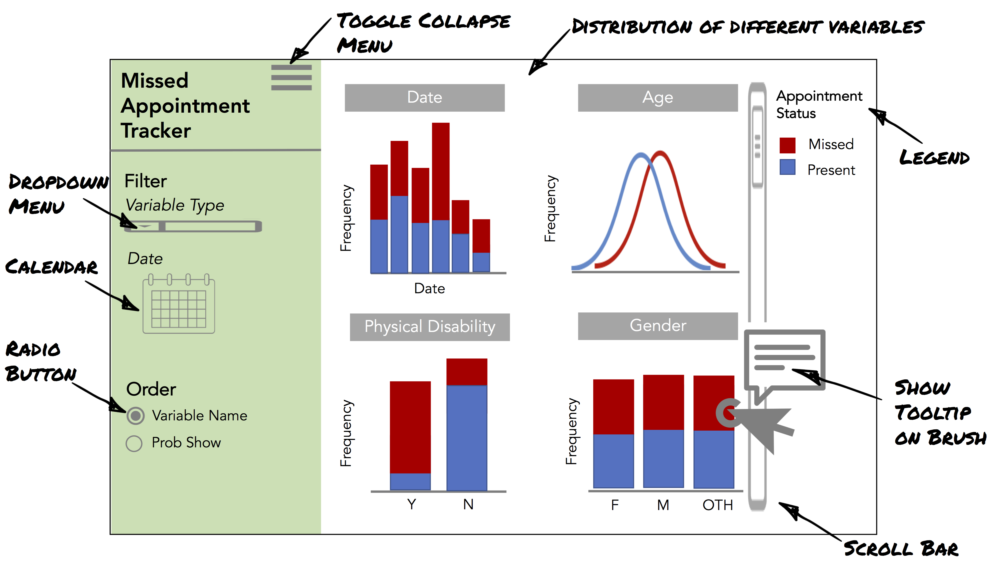

```{r setup, include=FALSE}
knitr::opts_chunk$set(echo = TRUE)
```

In this milestone, you will:

1) address peer review feedback as well as comments from the TAs. 
2) Create a Dashboard proposal
3) Get a very basic shell of your dashboard ready (with just a title and a running app required)

## Expectations
- **NEW** You should do the dashboard project in the SAME group project repository and keep your forks as-is.
- You should be committing to git every time you work on this project.
- git commit messages should be meaningful. These will be marked. It's OK if one or two are less meaningful, but most should be.
- After the repository is set-up, each group member should fork the repository to their personal GitHub.com account and work there, and send pull-requests of their work to the upstream repo (the one they forked). The other team mate should review, critique (if necessary) and finally accept their team mate's pull request.
  - See below for "how to catch up to a forked repo if there are changes upstream".
- Use GitHub issues to communicate to their team mate (as opposed to email or Slack)
- Your question, analysis and visualization should make sense. It doesn't have to be complicated.
- You should use proper grammar and full sentences in your README. Point form may occur, but should be less than 10% of your written documents.
- You **must** include the URL of your report in the `README.md` file of your project repo so we can easily view it.
- Create a release on your project repo named `milestoneX` and submit that URL on Canvas for us to grade.
- Your report should be knitted and rendered as an HTML or PDF file as described [here](https://stat545.stat.ubc.ca/evaluation/assignments/).
  - Here is an example of the URL we are expecting for each milestone: https://github.com/STAT547-UBC-2019-20/demo_project/tree/milestoneX
  
### Folder structre

- **NEW** You will be building a dashboard in the same repository as your report.
    - You should leave your current images, files, scripts, data as they are (clean up if needed based on TA/peer feedback) so your scripts still run
    - Do not create a new folder/directory for your app. All of the new files you need for the dashboard (this week just app.R) will be created in the root of your project. 
- `docs`: Move your Rmd files here, include your final report.
- `data`: All your data should be saved to this directory. Also, if you re-save your data after cleaning/wrangling, it should be saved as a new file here.
- `scripts` (or `src`): move all your scripts here. This directory should only contain scripts
- `images`: your scripts should export images to this directory, also include any images needed for your report
- `tests`: You may (optionally) add some tests to your functions and scripts in separate test files. See [this section](https://stat545guidebook.netlify.com/functional-programming-in-r-part-ii.html#how-should-i-organize-my-tests) from class notes that describes how to add tests to your scripts. 

## Mechanics (5%)

Follow the instructions for making a tidy submission, found on the [assignments home page](https://stat545.stat.ubc.ca/evaluation/assignments).

If there's any further uncertainty in determining a grade for this "mechanics" portion, the [UBC MDS mechanics rubric](https://github.com/UBC-MDS/public/blob/master/rubric/rubric_mech.md) will be referred to.

## Writing (10%)

- You must use proper English, spelling, and grammar.
- You should write concisely. 
- If there's any further uncertainty in determining a grade here, the [UBC MDS writing rubric](https://github.com/UBC-MDS/public/blob/master/rubric/rubric_writing.md) will be used.

## **Task 1. Address peer feedback** (40%)

Note: **You are NOT expected to address all of the feedback you receive! You will need to prioritize your efforts.** 

- Here is the priority I suggest for addressing feedback:

  1. Fixing scripts that do not run on all systems/operating systems
  1. Fixing documentation to make sure its consistent with how to actually run scripts
  1. Cleaning up the repo directory
  1. Improving script analysis/processing time (think about vectorization or using `purrr` functions)
  1. Improving plots
  1. Clarifying research questions
  1. Improving analyses
  1. Adding analyses (not required)
  1. Other feedback
  
In the issue where the feedback was posted, you should :

- Thank the student and/or TA for the feedback
- Acknowledge the feedback that you will have time to address
- Indicate which feedback you will relegate to "Future Work" 
- Create a new issue (link back to the old one) for **each** item you will not have time to fix and label it with "future work"
- Close the issue once items are appropriately addressed

## **Task 2: Dashboard Proposal** (50%)

The next part of your project requires you to create a dashboard for your dataset.
You need to make a proposal for a dashboard and it should have two components:

1. Dashboard description and usage scenarios (~ 300 words)
2. Dashboard sketch

If necessary, you should consider revising your research question(s) based on the feedback of your peers, and so it is appropriate for a dashboard. 
Then, consider how the dashboard can be used to answer your research question(s) by a fictional person - these are usage scenarios.
Building from your research questions, give a high-level description of the interface for the app you will build.
Remember to be realistic about your expectations and plans since you will actually be implementing this app next week and the week after.
All of this content should be approximately 300 words and live in the main project `README.md` file of your GitHub.com repository.

### Description

In this description you are not required to use terminology specific to Dash apps (i.e. widgets, components, etc...) or make reference to specific libraries.
Your sketch can be hand-drawn or mocked up using a graphics editor. 
If you can show the app visual design & interaction design in a single image that is ideal, but if you need more space to show other planned features of your app you can include up to a total of THREE images for this proposal. 
The sketch should be posted in the `README.md` file of your GitHub.com repository underneath the high level description.

#### Example description

> This app will have a landing page that shows the distribution (depending on data type, bar chart, density chart etc) of dataset factors (hypertension, physical disabilities etc.) colour coded according to whether or not patients showed up for an appointment. From a dropdown list, users will be able to filter out variables from the distribution display, by patient demographics (i.e. only show female patients), by appointment data (i.e. if SMS was sent), and finally by the date range of appointments. A different dropdown menu will allow users to re-order variables according to the probability of patients being a no-show or in alphabetical order to comorbidities. Users can compare the distribution of co-morbidities by scrolling down through the app interface.

### Usage Scenario

Usage scenarios are typically written in a narrative style and include the specific context of usage, tasks associated with that usage context, and a hypothetical walkthrough of how the user would accomplish those tasks with your app. 
If you are using a Kaggle dataset, you may use their "Overview (inspiration)" to create your usage scenario, or you may come up with your own inspiration.

An example usage scenario with tasks (tasks are indicated in brackets, i.e. [task])

> Mary is a policy maker with the Canadian Ministry of Health and she wants to understand what factors lead to missed appointments in order to devise an intervention that improves attendance numbers. 
She wants to be able to [explore] a dataset in order to [compare] the effect of different variables on absenteeism and [identify] the most relevant variables around which to frame her intervention policy. 
When Mary logs on to the "Missed Appointments app", she will see an overview of all the available variables in her dataset, according to the number of people that did or did not show up to their medical appointment. 
She can filter out variables for head-to-head comparisons, and/or rank order patients according to their predicted probability of missing an appointment. 
When she does so, Mary may notice that "physical disability" appears to be a strong predictor missing appointments, and in fact patients with a physical disability also have the largest number of missed appointments. 
She hypothesizes that patients with a physical disability could be having a hard time finding transportation to their appointments, and decides she needs to conduct a follow-on study since transportation information is not captured in her current dataset.

Note that in the above example, "physical disability" being an important variable is fictional - you don't need to conduct an analysis of your data to figure out what is important or not, you just need to imagine what someone could find, and how they may use this information.

### Example sketch

The example sketch shows the visual design of the app and one interactive feature (a tooltip).



*A further note on the app sketches:* 

This sketch is drawn up Powerpoint and using icons from the [noun project](https://thenounproject.com/). You can use others graphics tools (i.e. Photoshop, Illustrator, GIMP, or Inkscape, etc.) or you can even draw you app by hand and upload the scanned version of your drawing. Whatever you choose to do, make sure that the final image in your report is legible. Please note, this is a very basic illustrative guide to help you in this milestone, it is by no means the limit of what you should submit. 

## **Task 3. Start your dashboard** (10%)

For this task, we just want to make sure you have a functional Dash app with the skeleton as shown in lectures and assignment 04.
There are only two requirements:
  - Your app runs and launches
  - Your app has a title

**Important: It is not required for you to add any other Dash components!**

In milestone05 you will fill out the majority of your app!
