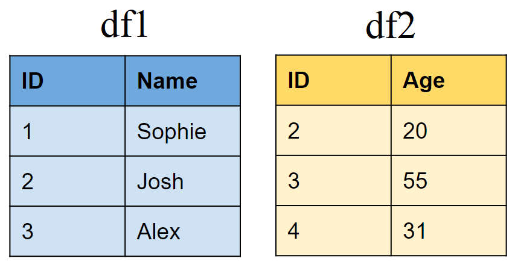
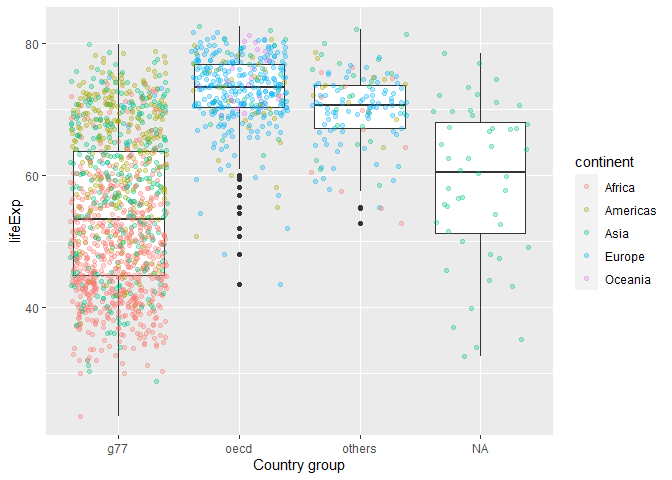

## Learning Objectives

From today's class, students are anticipated to be able to:

-   Recognize how to manipulate data through a variety of tibble joins such as:
    -   Mutating joins: `left_join()`, `right_join()`, `full_join()`, `anti_join()`
    -   Filtering joins: `semi_join()`, `anti_join()`
-   Perform binding: `bind_rows()`, `bind_cols()`
-   Joining more than 2 tibbles
-   Joining based on multiple conditions
-   Perform set operations on data: `intersect()`, `union()`, `setdiff()`

## Parallel Resources

This topic parallels the following resources. Take about 30 minutes to get acquainted with the following before coming to class:

-   [STAT 545 Episode 11-A: Tibble Joins with dplyr](https://youtu.be/YAdX9MVRY1c)
-   [Two-table verbs vignette](https://cran.r-project.org/web/packages/dplyr/vignettes/two-table.html)

We suggest referring to this material when engaging with today's topic.

## Additional Resources

-   [Jenny's Join Cheatsheet](https://stat545.com/join-cheatsheet.html) for a quick reference to joins.
-   [Relational Data chapter](https://r4ds.had.co.nz/relational-data.html) in "R for Data Science".
-   [dplyr cheatsheet](https://rstudio.com/wp-content/uploads/2015/02/data-wrangling-cheatsheet.pdf)

## Overview of join functions

**Note:** In order to merge two data frames, you need to have an identifier variable that has unique values for every row of observations in both datasets.

Create two sample data frames:

``` r
# First data frame
df1 <- data.frame(ID = 1:3,                     
                  Name = c("Sophie", "Josh","Alex"))

# Second data frame
df2 <- data.frame(ID = 2:4,                      
                  Age = c(20,50,31))
```



## Mutating joins

### Join matching rows from df2 to df1


``` r
left_join(df1, df2, by = "ID")
```

    ##   ID   Name Age
    ## 1  1 Sophie  NA
    ## 2  2   Josh  20
    ## 3  3   Alex  50

### Join matching rows from df1 to df2


``` r
right_join(df1, df2, by = "ID")
```

    ##   ID Name Age
    ## 1  2 Josh  20
    ## 2  3 Alex  50
    ## 3  4 <NA>  31

### Retain only rows present in both sets


``` r
inner_join(df1, df2, by = "ID")
```

    ##   ID Name Age
    ## 1  2 Josh  20
    ## 2  3 Alex  50

### Retain all values, all rows


``` r
full_join(df1, df2, by = "ID")
```

    ##   ID   Name Age
    ## 1  1 Sophie  NA
    ## 2  2   Josh  20
    ## 3  3   Alex  50
    ## 4  4   <NA>  31

## Filtering joins

### Retain all rows in df1 that have a match in df2


``` r
semi_join(df1, df2, by = "ID")
```

    ##   ID Name
    ## 1  2 Josh
    ## 2  3 Alex

### Retain all rows in df1 that do not have a match in df2


``` r
anti_join(df1, df2, by = "ID")
```

    ##   ID   Name
    ## 1  1 Sophie

## Binding

### Append df2 to df1 as new rows


``` r
bind_rows(df1, df2)
```

    ##   ID   Name Age
    ## 1  1 Sophie  NA
    ## 2  2   Josh  NA
    ## 3  3   Alex  NA
    ## 4  2   <NA>  20
    ## 5  3   <NA>  50
    ## 6  4   <NA>  31

### Append df2 to df1 as new columns


``` r
bind_cols(df1, df2)
```

    ## New names:
    ## * ID -> ID...1
    ## * ID -> ID...3

    ##   ID...1   Name ID...3 Age
    ## 1      1 Sophie      2  20
    ## 2      2   Josh      3  50
    ## 3      3   Alex      4  31

## Joining multiple (&gt;2) tibbles

Create a third data frame

``` r
df3 <- data.frame(ID = 1:5,                      
                  Height = c(175,167,190,155,160))
```


Use piping operator (%&gt;%) to layer multiple join functions

``` r
full_join(df1, df2, by = "ID") %>%
  full_join(., df3, by = "ID") 
```

    ##   ID   Name Age Height
    ## 1  1 Sophie  NA    175
    ## 2  2   Josh  20    167
    ## 3  3   Alex  50    190
    ## 4  4   <NA>  31    155
    ## 5  5   <NA>  NA    160

## Joining tibbles on multiple conditions


Create two new tibbles df4 and df5

``` r
df4 <- data.frame(FirstName = c("Sophie", "Josh","Alex"),
                  LastName=c("Wang","Smith","Smith"),
                  Age = c(42,20,50))

df5 <- data.frame(First_name = c("Josh","Alex","Sophie"),        
                  Last_name=c("Smith","Smith","Jones"),
                  Height = c(167,190,155))
```


``` r
full_join(df4, df5, by = c("FirstName" = "First_name", "LastName" = "Last_name"))
```

    ##   FirstName LastName Age Height
    ## 1    Sophie     Wang  42     NA
    ## 2      Josh    Smith  20    167
    ## 3      Alex    Smith  50    190
    ## 4    Sophie    Jones  NA    155

## Set operations

Create sample data frames


``` r
# First data frame
df6 <- data.frame(Number = 1:3,                     
                  Letter = c("A", "B","C"))

# Second data frame
df7 <- data.frame(Number = 2:4,                      
                  Letter = c("B","C","D"))
```

### Include rows that appear in both data frames


``` r
intersect(df6, df7)
```

    ##   Number Letter
    ## 1      2      B
    ## 2      3      C

### Include rows that appear in either or both data frames


``` r
union(df6, df7)
```

    ##   Number Letter
    ## 1      1      A
    ## 2      2      B
    ## 3      3      C
    ## 4      4      D

### Include rows that appear in one df but not another


Include rows that appear in df6 but not in df7

``` r
setdiff(df6, df7)
```

    ##   Number Letter
    ## 1      1      A

Include rows that appear in df7 but not in df6

``` r
setdiff(df7, df6)
```

    ##   Number Letter
    ## 1      4      D

## Demonstration with `gapminder`

Get an overview of `gapminder` data

``` r
glimpse(gapminder)
```

    ## Rows: 1,704
    ## Columns: 6
    ## $ country   <fct> "Afghanistan", "Afghanistan", "Afghanistan", "Afghanistan", ~
    ## $ continent <fct> Asia, Asia, Asia, Asia, Asia, Asia, Asia, Asia, Asia, Asia, ~
    ## $ year      <int> 1952, 1957, 1962, 1967, 1972, 1977, 1982, 1987, 1992, 1997, ~
    ## $ lifeExp   <dbl> 28.801, 30.332, 31.997, 34.020, 36.088, 38.438, 39.854, 40.8~
    ## $ pop       <int> 8425333, 9240934, 10267083, 11537966, 13079460, 14880372, 12~
    ## $ gdpPercap <dbl> 779.4453, 820.8530, 853.1007, 836.1971, 739.9811, 786.1134, ~

### Part 1

Obtain additional information on countries from other open data sources

``` r
country_data <- read.csv(file = "https://raw.githubusercontent.com/open-numbers/ddf--gapminder--geo_entity_domain/master/ddf--entities--geo--country.csv")

glimpse(country_data)
```

    ## Rows: 273
    ## Columns: 33
    ## $ country                <chr> "abkh", "afg", "akr_a_dhe", "ala", "alb", "dza"~
    ## $ gwid                   <chr> "i0", "i1", "i2", "i258", "i3", "i4", "i5", "i6~
    ## $ name                   <chr> "Abkhazia", "Afghanistan", "Akrotiri and Dhekel~
    ## $ world_6region          <chr> "europe_central_asia", "south_asia", "europe_ce~
    ## $ income_groups          <chr> "", "low_income", "", "", "upper_middle_income"~
    ## $ landlocked             <chr> "", "landlocked", "coastline", "coastline", "co~
    ## $ g77_and_oecd_countries <chr> "others", "g77", "others", "others", "others", ~
    ## $ main_religion_2008     <chr> "", "muslim", "", "", "muslim", "muslim", "chri~
    ## $ gapminder_list         <chr> "Abkhazia", "Afghanistan", "Akrotiri and Dhekel~
    ## $ alternative_1          <chr> "", "Islamic Republic of Afghanistan", "", "â\2~
    ## $ alternative_2          <chr> "", "", "", "", "", "", "", "", "", "", "", "",~
    ## $ alternative_3          <chr> "", "", "", "", "", "", "", "", "", "", "", "",~
    ## $ alternative_4_cdiac    <chr> "", "Afghanistan", "", "", "Albania", "Algeria"~
    ## $ pandg                  <chr> "", "AFGHANISTAN", "", "", "ALBANIA", "ALGERIA"~
    ## $ god_id                 <chr> "GE-AB", "AF", "Akrotiri_Dhekelia", "AX", "AL",~
    ## $ alt_5                  <chr> "", "", "", "", "", "", "", "", "", "", "", "",~
    ## $ upper_case_name        <chr> "", "AFGHANISTAN", "", "AALAND ISLANDS", "ALBAN~
    ## $ iso3166_1_alpha2       <chr> "", "AF", "", "AX", "AL", "DZ", "AS", "AD", "AO~
    ## $ iso3166_1_alpha3       <chr> "", "AFG", "", "ALA", "ALB", "DZA", "ASM", "AND~
    ## $ iso3166_1_numeric      <int> NA, 4, NA, 248, 8, 12, 16, 20, 24, 660, 10, 28,~
    ## $ iso3166_2              <chr> "", "", "", "", "", "", "", "", "", "", "", "",~
    ## $ unicode_region_subtag  <chr> "", "AF", "", "AX", "AL", "DZ", "AS", "AD", "AO~
    ## $ arb1                   <chr> "", "", "", "", "", "", "", "", "", "", "", "",~
    ## $ arb2                   <chr> "", "", "", "", "", "", "", "", "", "", "", "",~
    ## $ arb3                   <chr> "", "", "", "", "", "", "", "", "", "", "", "",~
    ## $ arb4                   <chr> "", "", "", "", "", "", "", "", "", "", "", "",~
    ## $ arb5                   <chr> "", "", "", "", "", "", "", "", "", "", "", "",~
    ## $ arb6                   <chr> "", "", "", "", "", "", "", "", "", "", "", "",~
    ## $ is..country            <lgl> TRUE, TRUE, TRUE, TRUE, TRUE, TRUE, TRUE, TRUE,~
    ## $ un_state               <lgl> FALSE, TRUE, FALSE, FALSE, TRUE, TRUE, FALSE, T~
    ## $ world_4region          <chr> "europe", "asia", "europe", "europe", "europe",~
    ## $ latitude               <dbl> NA, 33.00000, NA, 60.25000, 41.00000, 28.00000,~
    ## $ longitude              <dbl> NA, 66.00000, NA, 20.00000, 20.00000, 3.00000, ~

Narrow down information to income groups, OECD status, and religion

``` r
country_data <- country_data %>% 
  select(name, income_groups, g77_and_oecd_countries, main_religion_2008)

# Check data structure
glimpse(country_data)
```

    ## Rows: 273
    ## Columns: 4
    ## $ name                   <chr> "Abkhazia", "Afghanistan", "Akrotiri and Dhekel~
    ## $ income_groups          <chr> "", "low_income", "", "", "upper_middle_income"~
    ## $ g77_and_oecd_countries <chr> "others", "g77", "others", "others", "others", ~
    ## $ main_religion_2008     <chr> "", "muslim", "", "", "muslim", "muslim", "chri~

Count how many unique country names are in `gapminder` and `country_data`

``` r
nlevels(gapminder$country)
```

    ## [1] 142

``` r
nlevels(as.factor(country_data$name))
```

    ## [1] 273

Merge `gapminder` and `country_data` using `left_join()`

``` r
gapminder_extended <- left_join(gapminder, country_data, by=c("country"="name"))

head(gapminder_extended)
```

    ## # A tibble: 6 x 9
    ##   country     continent  year lifeExp      pop gdpPercap income_groups
    ##   <chr>       <fct>     <int>   <dbl>    <int>     <dbl> <chr>        
    ## 1 Afghanistan Asia       1952    28.8  8425333      779. low_income   
    ## 2 Afghanistan Asia       1957    30.3  9240934      821. low_income   
    ## 3 Afghanistan Asia       1962    32.0 10267083      853. low_income   
    ## 4 Afghanistan Asia       1967    34.0 11537966      836. low_income   
    ## 5 Afghanistan Asia       1972    36.1 13079460      740. low_income   
    ## 6 Afghanistan Asia       1977    38.4 14880372      786. low_income   
    ## # ... with 2 more variables: g77_and_oecd_countries <chr>,
    ## #   main_religion_2008 <chr>

**Note:**: `left_join()` is probably the most useful and the most used join. It is often used when you want to expand your existing dataset with new variables from other sources.

Compare lifeExp for OECD, G77, and other countries

``` r
gapminder_extended %>% 
  ggplot(aes(x=g77_and_oecd_countries,y=lifeExp))+
    geom_boxplot()+
    geom_jitter(aes(color=continent), alpha=0.3)+
    labs(x="Country group")
```



Compare lifeExp for OECD, G77, and other countries by most common religion

``` r
gapminder_extended %>% 
  filter(main_religion_2008 %in% c("christian","eastern_religions","muslim")) %>% 
  ggplot(aes(x=g77_and_oecd_countries,y=lifeExp))+
    geom_boxplot()+
    geom_jitter(aes(color=continent), alpha=0.3)+
    labs(x="Country group")+
    facet_wrap(~main_religion_2008)
```


### Part 2

Gapminder data is only available from 1952 to 2007. What if we wanted to examine data after 2007 as well as population projections?

Download population size estimates by country from 1800 to 2100

``` r
population <- gsheet2tbl("https://docs.google.com/spreadsheets/d/14_suWY8fCPEXV0MH7ZQMZ-KndzMVsSsA5HdR-7WqAC0/edit#gid=176703676")
```

See what population data looks like

``` r
glimpse(population)
```

    ## Rows: 59,297
    ## Columns: 4
    ## $ geo        <chr> "afg", "afg", "afg", "afg", "afg", "afg", "afg", "afg", "af~
    ## $ name       <chr> "Afghanistan", "Afghanistan", "Afghanistan", "Afghanistan",~
    ## $ time       <dbl> 1800, 1801, 1802, 1803, 1804, 1805, 1806, 1807, 1808, 1809,~
    ## $ Population <dbl> 3280000, 3280000, 3280000, 3280000, 3280000, 3280000, 32800~

Only retain population estimates after 2007, rename variables to match gapminder variable names

``` r
population <- population %>% 
  filter(time>2007) %>% 
  rename(year=time, country=name, pop=Population) %>% 
  select(-geo)
```

Add continent data to `population` from `gapminder`

``` r
# create a data frame listing continent for every country
continent <- gapminder %>%
  select(country, continent) %>% 
  distinct()

# add continent data to population data frame
population <- left_join(population, continent, by = "country")

# see how many countries are missing continent data by continent
population %>% 
  group_by(year) %>% 
  summarise(missing_continent = sum(is.na(continent)))
```

    ## # A tibble: 93 x 2
    ##     year missing_continent
    ##    <dbl>             <int>
    ##  1  2008                61
    ##  2  2009                61
    ##  3  2010                61
    ##  4  2011                61
    ##  5  2012                61
    ##  6  2013                61
    ##  7  2014                61
    ##  8  2015                61
    ##  9  2016                61
    ## 10  2017                61
    ## # ... with 83 more rows

Use `bind_rows()` to stack `population` below `gapminder`

``` r
gapminder_pop <- bind_rows(gapminder, population) %>% 
  arrange(country,year)
```

Visualize trends in population growth by continent

``` r
gapminder_pop %>% 
  filter(!is.na(continent)) %>% 
  group_by(continent, year) %>%
  summarise(pop=sum(pop)/1000000) %>%
  ggplot(aes(x=year, y=pop, fill=continent))+
  geom_area()+
  labs(title="Population projections by continent", 
               y="Population (in mil)")
```

    ## `summarise()` has grouped output by 'continent'. You can override using the `.groups` argument.


